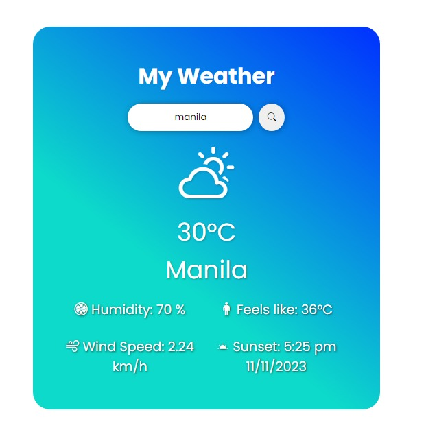

# Weather API App

### Screenshots

## Overview

WeatherNow is designed for simplicity, providing a hassle-free experience for users who prioritize quick weather updates. Whether you're planning a trip or just checking the current weather, WeatherNow keeps it simple and to the point.

Feel the temperature, stay informed, and enjoy the straightforward experience with WeatherNow.

This small web application, developed using HTML, CSS, and JavaScript, leverages the OpenWeather API to provide real-time weather information. Users can access accurate and up-to-date weather data seamlessly.

### Key Features

- **Temperature Display:**

  - Instantly view the current temperature of any city.

- **Additional Key Features:**

  - **Humidity:**

    - Display the current humidity level (e.g., Humidity: 69%).

  - **Wind Speed:**

    - Provide information on the current wind speed (e.g., Wind Speed: 2.93 km/h).

  - **Feels Like:**

    - Indicate the perceived temperature, often accounting for factors like humidity and wind (e.g., Feels like: 29°C).

  - **Sunset Time:**
    - Show the time of sunset with the date (e.g., Sunset: 6:51 pm 11/11/2023).

- **Basic API Details:**
  - Access essential API details to understand the source of weather information.

### How to Use

1. Enter the desired city name in the search bar.
2. Get immediate access to the current temperature and basic API details for the specified location.

To run the project locally, follow these steps:

1. Clone the repository: git clone https://github.com/frogerall/weather-api.git

2. Open the `index.html` file in your preferred web browser.

---

### Technologies Used

- HTML
- CSS
- JavaScript
- [OpenWeather API](https://openweathermap.org/)

## Future Plans

### Header and Footer Integration

#### Extended Forecast

- Provide a multi-day forecast to give users an overview of the upcoming weather conditions.

#### Temperature Trends

- Show temperature trends, such as highs and lows, over a specified period.

#### Hourly Forecas

- Include an hourly breakdown of weather conditions to help users plan their day more effectively.

#### Weather Maps

- Integrate weather maps to visualize current conditions, such as precipitation, wind patterns, and temperature gradients.

#### User Location Detection

- Implement a feature to automatically detect the user's location and display the local weather without manual input.

#### Feedback Mechanism

- Implement a feedback system for users to report inaccuracies or provide suggestions for improvement.

### Contributions

Contributions to the project are highly appreciated. If you'd like to contribute, follow these steps:

1. Fork the repository.
2. Create a new branch for your feature or bug fix.
3. Make your changes and submit a pull request.

### External Resources

- **OpenWeather API:**

  - The application uses the [OpenWeather API](https://openweathermap.org/) for retrieving current weather data.

- **GreatStack Tutorial:**

  - A big thanks to GreatStack for the insightful tutorial that greatly contributed to the development of this project. [Watch the tutorial](https://www.youtube.com/watch?v=MIYQR-Ybrn4)

- **Live Demo:**

  - Explore the live demo of the Weather API App: [Live Demo](https://frogerall.github.io/weather-api/)

- **Article on API Key Security:**

  - For securing API keys, refer to this valuable article: [API Key Security](https://gist.github.com/derzorngottes/3b57edc1f996dddcab25)

  ## Help

If you encounter common problems or issues while using this kindly contact me on my email

## Authors

**Author:**

You can reach out to me for suggestions, comments, or just to chat:

- Adrian Salitico
- [GitHub](https://github.com/frogerall)
- [LinkedIn](https://linkedin.com/in/nairda4)
- Email: saliticoadrian@gmail.com

(<a href="#readme-top">back to top</a>)

## Acknowledgments

Inspiration, code snippets, etc.
